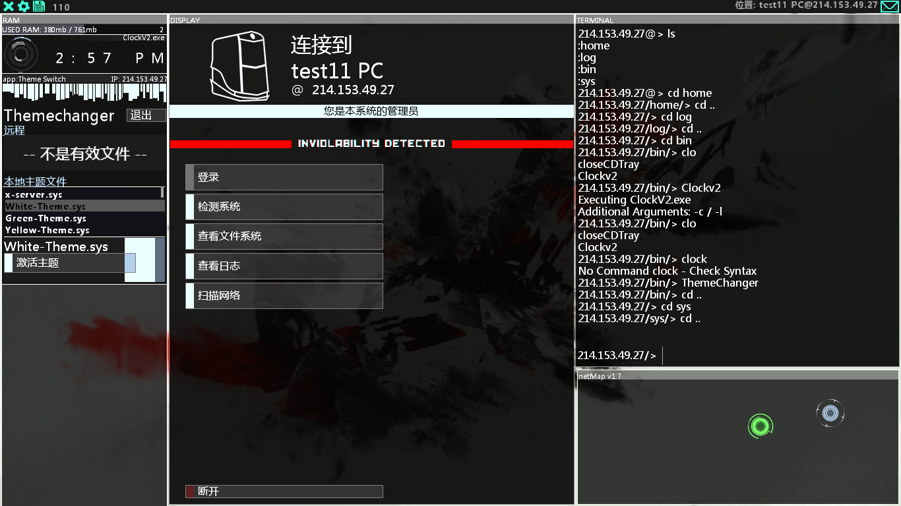
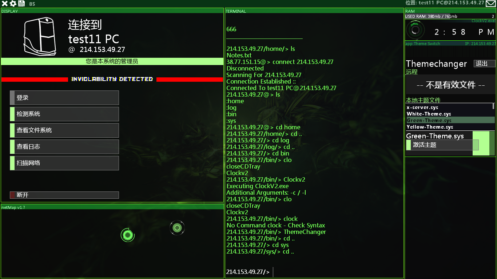
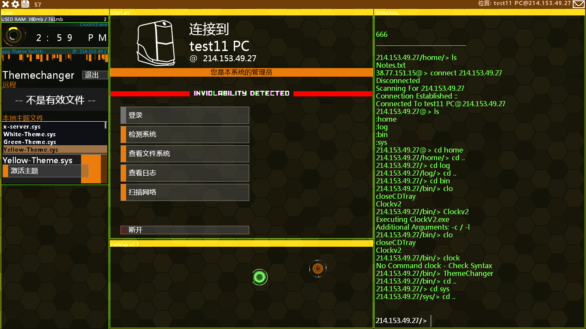
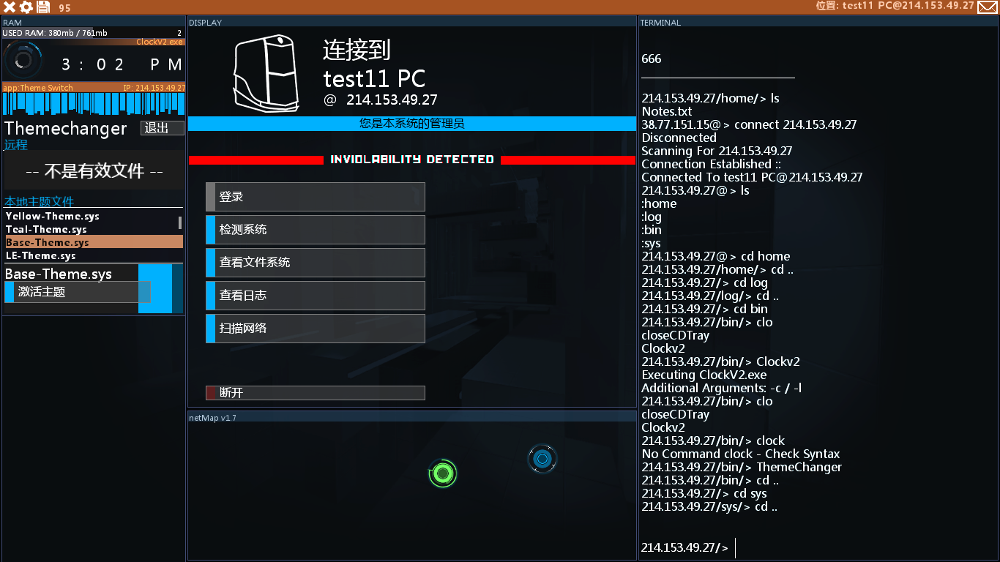
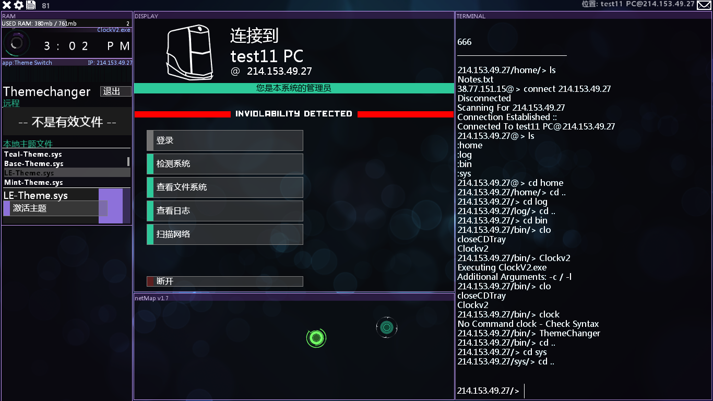
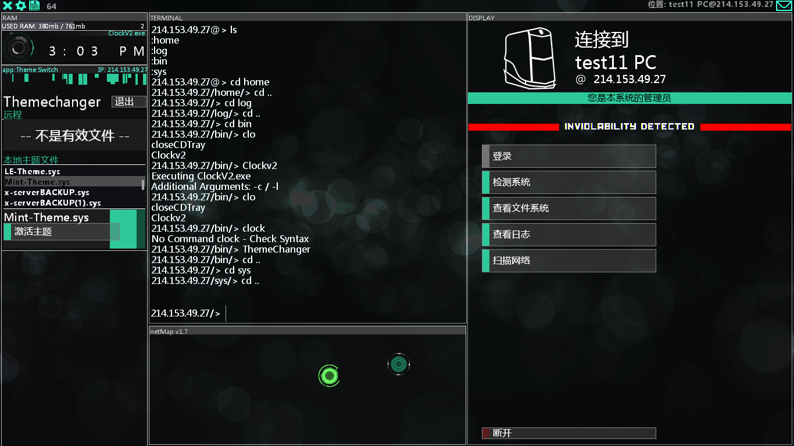

# 自替换占位符
**自替换占位符**是指在Hacknet中会被自动替换成特定内容的标识  

自替换占位符的结构为:#<标识符,不包含尖括号>#,如#BINARY#  

可用的标识符有:
- `BINARY` 垃圾二进制内容(2000字符)
- `BINARYSMALL` 较少的垃圾二进制内容(1000字符)
- `PLAYER_IP` 玩家IP地址
- `PLAYERNAME` 玩家名
- `RANDOM_IP` 一个随机的IP

以及一些文件的标识符:
- `SSH_CRACK` SSHCrack程序
- `FTP_CRACK` 原版FTP破解程序
- `WEB_CRACK` Web(80)破解程序
- `SMTP_CRACK` SMTP破解程序
- `SQL_CRACK` SQL破解程序
- `HEXCLOCK_EXE` HexClock.exe程序
- `CLOCK_PROGRAM` Clock.exe程序
- `DECYPHER_PROGRAM` DEC解密程序
- `DECHEAD_PROGRAM` DEC获取头信息程序
- `MEDICAL_PROGRAM` KBT(104)端口破解程序
- `THEMECHANGER_EXE` 主题更改器,ThemeChanger.exe
- `EOS_SCANNER_EXE` eos设备扫描程序
- `SECURITYTRACER_PROGRAM` 开局的SecurityTracer.exe(好东西,可以很快地停止trace)
- `TRACEKILL_EXE` Vapor给你的TraceKill.exe
- `EXT_SEQUENCER_EXE` 在扩展中可以使用的Sequencer.exe,在ExtensionInfo.xml中定义其属性

DLC特供:
- `TORRENT_EXE` Torrent(6881)破解程序
- `SSL_EXE` SSL(443)破解程序
- `FTP_FAST_EXE` DLC更快的FTP破解程序
- `SIGNAL_SCRAMBLER_EXE` SignalScrambler.exe,占用内存来延长trace的程序
- `MEM_FORENSICS_EXE` 内存转储查看程序
- `MEM_DUMP_GENERATOR` 内存转储生成工具
- `PACIFIC_EXE` 飞机端口(192)破解程序
- `NETMAP_ORGANIZER_EXE` netmap排列程序
- `SHELL_CONTROLLER_EXE` 原版不存在的Comshell.exe,快速操作shell的程序
- `NOTES_DUMPER_EXE` 能从本地文件读取笔记的程序
- `DLC_MUSIC_EXE` DLC调音乐程序
- `CLOCK_V2_EXE` 下文主题中显示的ClockV2
- `SHELL_OPENER_EXE` 原版不存在,快速打开shell的程序

一些主题附上图片:  
`WHITE_THEME` :  
  

`GREEN_THEME` :  
  

`YELLOW_THEME` :  
  

`TEAL_THEME` :  
  

`BASE_THEME` :  
  

`PURPLE_THEME` :  
  

`MINT_THEME` :  
